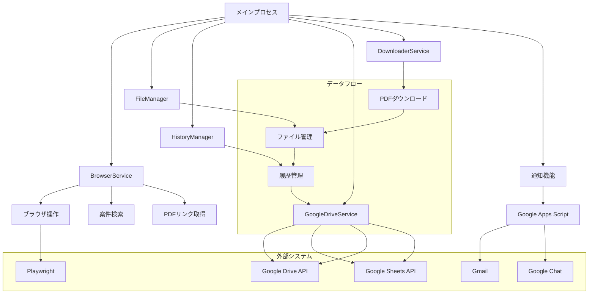

# 入札情報PDFダウンローダー (Bid Information PDF Downloader)

岩手県入札情報公開サービスから特定の業務に関するPDFファイルを自動的にダウンロードするツールです。

## 機能

- 岩手県入札情報公開サービスから特定の業務名を含む案件を検索
- 設定したキーワードを含むPDFファイルを自動ダウンロード
- Google Apps Scriptを使用した通知機能（メールとGoogle Chatに対応）
- ダウンロードしたファイルをGoogle Driveにアップロード
- Google Spreadsheetへの案件情報の記録
- ダウンロード履歴の管理

## アーキテクチャ



## 必要条件

- Node.js (v16以上)
- Chromium ブラウザ
- インターネット接続

## インストール方法

1. リポジトリをクローンまたはダウンロードします

```bash
git clone https://github.com/yourusername/bid-info-downloader.git
cd bid-info-downloader
```

2. 依存パッケージをインストールします

```bash
npm install
```

3. Playwrightのブラウザをインストールします

```bash
npx playwright install chromium
```

4. 設定ファイルを作成します

```bash
cp config_example.toml config.toml
```

5. `config.toml` を編集して設定を行います

## 設定

`config.toml` ファイルで以下の設定を行います：

- `topPage`: 岩手県入札情報公開サービスのトップページURL
- `projectTitle`: 検索する業務名（例: "設計"）
- `downloadOnlyNew`: 新着案件のみダウンロードするかどうか
- `numberOfItems`: 1ページあたりの表示件数（10, 25, 50, 100）
- `pdfKeywords`: ダウンロードするPDFのキーワード（例: ["公告", "図面"]）
- `fileCheckEnabled`: ダウンロード後にファイルの存在チェックを行うかどうか
- `downloadTimeoutSec`: ダウンロードのタイムアウト時間（秒）
- `pdfClickDelaySec`: PDFリンクのクリック間隔（秒）

### 通知設定

Google Apps Scriptを使用した通知機能を使用する場合は、`[notification]` セクションで以下の設定を行います：

- `enabled`: 通知機能を有効にするかどうか
- `gasUrl`: Google Apps ScriptのWebアプリURL
- `apiKey`: APIキー（認証用）

### Google Drive設定

Google Driveへのアップロードを使用する場合は、`[googleDrive]` セクションで以下の設定を行います：

- `uploadEnabled`: Google Driveへのアップロードを有効にするかどうか
- `serviceAccountKeyPath`: サービスアカウントのキーファイル（JSON）のパス
- `folderId`: アップロード先のフォルダID
- `spreadsheetId`: 案件情報を記録するスプレッドシートID（任意）

### デバッグ設定

デバッグ設定は、`[debug]` セクションで行います：

- `debugEnabled`: デバッグモードを有効にするかどうか
- `headless`: ヘッドレスモードを有効にするかどうか

## 使用方法

1. ビルドします

```bash
npm run build
```

2. 実行します

```bash
npm run start
```

開発モードで実行する場合（ビルドと実行を一度に行う）：

```bash
npm run dev
```

Google Driveへのアップロードのみを行う場合：

```bash
npm run upload
```

## プロジェクト構造

```
src/
├── types/                  # 型定義
│   └── index.ts            # すべての型定義
├── services/               # 機能ごとのサービス
│   ├── browserService.ts   # ブラウザ操作関連
│   ├── downloaderService.ts # ダウンロード処理
│   ├── fileManager.ts      # ファイル管理
│   ├── historyManager.ts   # ダウンロード履歴管理
│   └── googleDriveService.ts # Google Driveアップロード
├── utils/                  # ユーティリティ関数
│   └── helpers.ts          # 汎用ヘルパー関数
├── gas/                    # Google Apps Script関連
│   ├── notification.js     # 通知用GASスクリプト
│   └── README.md           # GASの設定方法
├── @types/                 # グローバル型定義
│   └── global.d.ts         # グローバル型定義
├── config.ts               # 設定管理
├── getContractDetails.ts   # 契約詳細情報取得
├── index.ts                # エントリーポイント
├── logger.ts               # ロギング
└── notification.ts         # 通知機能
```

## 自動実行設定

crontabを使用して定期的に実行するように設定できます：

1. crontabを編集します

```bash
crontab -e
```

2. 以下の行を追加します（例: 毎日午前9時に実行）

```
0 9 * * * cd /path/to/bid-info-downloader && /usr/bin/node dist/index.js >> /path/to/bid-info-downloader/logs/cron.log 2>&1
```

## Google Apps Script通知機能の設定

1. `src/gas/README.md` の手順に従ってGoogle Apps Scriptプロジェクトを作成します
2. `src/gas/notification.js` のコードをGoogle Apps Scriptエディタにコピーします
3. スクリプトプロパティを設定し、Webアプリとしてデプロイします
4. デプロイURLとAPIキーを `config.toml` の `[notification]` セクションに設定します

## Google Driveサービスアカウントの設定方法

1. [Google Cloud Console](https://console.cloud.google.com/)にアクセスし、プロジェクトを作成または選択します

2. Google Drive APIとGoogle Sheets APIを有効にします
   - 「APIとサービス」→「ライブラリ」を選択
   - 「Google Drive API」と「Google Sheets API」を検索して有効にする

3. サービスアカウントを作成します
   - 「APIとサービス」→「認証情報」を選択
   - 「認証情報を作成」→「サービスアカウント」を選択
   - サービスアカウント名、説明を入力し、「作成して続行」をクリック
   - 「ロールを選択」で「基本」→「編集者」を選択（または必要な権限を設定）
   - 「完了」をクリック

4. サービスアカウントのキーを作成します
   - 作成したサービスアカウントの行をクリック
   - 「キー」タブを選択
   - 「鍵を追加」→「新しい鍵を作成」→「JSON」を選択
   - キーファイル（JSON）がダウンロードされます

5. Google Driveでフォルダを共有します
   - Google Driveで、アップロード先のフォルダを作成または選択
   - フォルダを右クリック→「共有」を選択
   - サービスアカウントのメールアドレス（キーファイル内の`client_email`）を入力
   - 「編集者」権限を付与して「送信」をクリック

6. スプレッドシートを設定します（任意）
   - Google Driveでスプレッドシートを作成または選択
   - スプレッドシートを共有（上記と同様の手順）
   - スプレッドシートIDを `config.toml` の `spreadsheetId` に設定

7. `config.toml`を設定します
   - `uploadEnabled = true`に設定
   - `serviceAccountKeyPath`にダウンロードしたキーファイルのパスを設定
   - `folderId`にアップロード先のフォルダIDを設定（フォルダURLの末尾の部分）

## ライセンス

ISC

## 注意事項

- このツールは個人的な利用を目的としています
- サーバーに過度な負荷をかけないようにご注意ください